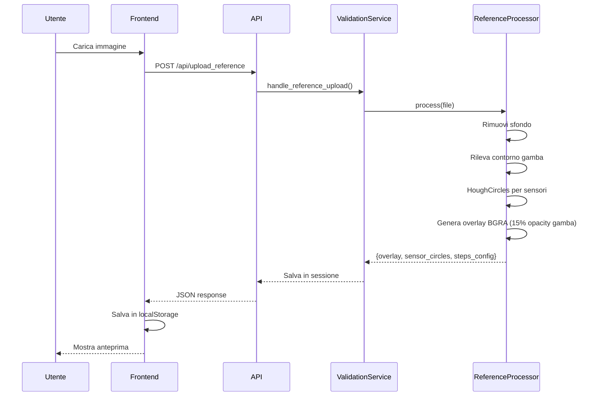
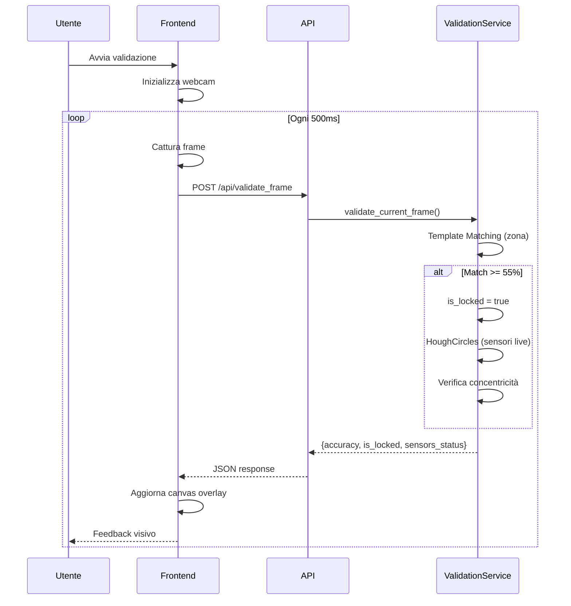

# Kin.ai - Sensor Placement Validator

Sistema di validazione in tempo reale per il posizionamento di sensori su parti del corpo, progettato per applicazioni medicali e di monitoraggio.

---

## 📋 Indice

1. [Panoramica](#panoramica)
2. [Architettura](#architettura)
3. [Tecnologie](#tecnologie)
4. [Struttura del Progetto](#struttura-del-progetto)
5. [Flusso di Lavoro](#flusso-di-lavoro)
6. [API Endpoints](#api-endpoints)
7. [Sistema di Validazione](#sistema-di-validazione)
8. [Versioning](#versioning)
9. [Installazione](#installazione)
10. [Configurazione](#configurazione)

---

## 🔭 Panoramica

**Kin.ai Sensor Placement Validator** è un'applicazione web che permette di:

1. **Caricare un'immagine di riferimento** (es. una gamba con sensori applicati)
2. **Rimuovere automaticamente lo sfondo** dell'immagine
3. **Rilevare i sensori** (cerchi) presenti nell'immagine
4. **Generare un overlay visivo** con contorno e posizioni dei sensori
5. **Validare in tempo reale** via webcam che i sensori siano posizionati correttamente

Il sistema è pensato per applicazioni dove è fondamentale che dispositivi (sensori, elettrodi, marker) siano posizionati in modo preciso e ripetibile.

---

## 🏗️ Architettura

### Pattern Architetturale

L'applicazione segue un'architettura **a 3 livelli** (Three-Tier):

```
┌─────────────────────────────────────────────────────────┐
│                    PRESENTATION LAYER                    │
│  (templates/ + static/)                                 │
│  - Jinja2 Templates (HTML)                              │
│  - TailwindCSS Styling                                  │
│  - JavaScript Frontend (main.js)                        │
└─────────────────────────────────────────────────────────┘
                          │
                          ▼
┌─────────────────────────────────────────────────────────┐
│                    APPLICATION LAYER                     │
│  (app.py + services/)                                   │
│  - Flask Routes & API Endpoints                         │
│  - ValidationService (orchestrazione)                   │
│  - CameraService (gestione webcam)                      │
└─────────────────────────────────────────────────────────┘
                          │
                          ▼
┌─────────────────────────────────────────────────────────┐
│                    PROCESSING LAYER                      │
│  (processors/ + utils/)                                 │
│  - ReferenceProcessor (analisi immagine)                │
│  - Background Removal (API + fallback)                  │
│  - Computer Vision (OpenCV, HoughCircles)               │
└─────────────────────────────────────────────────────────┘
```

### Componenti Principali

| Componente | Responsabilità |
|------------|----------------|
| `app.py` | Entry point Flask, routing, API endpoints |
| `ValidationService` | Orchestrazione validazione, gestione sessioni |
| `ReferenceProcessor` | Analisi immagine riferimento, rilevamento sensori |
| `CameraService` | Gestione stream webcam con threading |
| `SensorValidationApp` | Classe JavaScript per UI/UX validazione |

---

## 🛠️ Tecnologie

### Backend

| Tecnologia | Versione | Utilizzo |
|------------|----------|----------|
| **Python** | 3.10+ | Linguaggio principale |
| **Flask** | 2.x | Web framework |
| **OpenCV** | 4.x | Computer Vision (HoughCircles, Template Matching) |
| **NumPy** | 1.x | Elaborazione array/matrici |
| **Pillow** | 9.x | Manipolazione immagini |
| **python-dotenv** | - | Gestione variabili ambiente |

### Frontend

| Tecnologia | Versione | Utilizzo |
|------------|----------|----------|
| **TailwindCSS** | 3.x (CDN) | Styling utility-first |
| **Bootstrap Icons** | 1.10 | Icone UI |
| **Jinja2** | (Flask) | Templating HTML |
| **Vanilla JS** | ES6+ | Logica frontend |

### Servizi Esterni

| Servizio | Utilizzo |
|----------|----------|
| **remove.bg API** | Rimozione sfondo (opzionale) |
| **GrabCut** (OpenCV) | Fallback locale per rimozione sfondo |

---

## 📁 Struttura del Progetto

```
posizionamento-realtime/
├── app.py                      # Entry point Flask
├── config.py                   # Configurazione centralizzata
├── CHANGELOG_VALIDAZIONE.md    # Log modifiche sistema validazione
├── README.md                   # Questa documentazione
│
├── processors/                 # Elaborazione immagini
│   ├── __init__.py
│   └── reference_processor.py  # Analisi riferimento + rilevamento sensori
│
├── services/                   # Logica di business
│   ├── __init__.py
│   ├── validation_service.py   # Orchestrazione validazione live
│   └── camera_service.py       # Gestione webcam con threading
│
├── utils/                      # Utility riutilizzabili
│   ├── __init__.py
│   ├── background_removal.py   # Rimozione sfondo (API + GrabCut)
│   ├── sensor_utils.py         # Verifica colore sensori
│   ├── geometry_utils.py       # Calcoli geometrici
│   ├── image_processing.py     # Elaborazione immagini
│   └── video_utils.py          # Utility video
│
├── templates/                  # Template Jinja2
│   ├── base.html               # Layout base con navbar
│   ├── index.html              # Homepage
│   ├── upload.html             # Pagina caricamento riferimento
│   ├── validation.html         # Pagina validazione live
│   └── login.html              # Pagina login (stub)
│
├── static/                     # Asset statici
│   ├── css/                    # Fogli di stile custom
│   └── js/
│       └── main.js             # SensorValidationApp (class JS)
│
├── venv/                       # Virtual environment
└── uploads/                    # Cartella upload (runtime)
```

---

## 🔄 Flusso di Lavoro

### 1. Caricamento Riferimento



### 2. Validazione Live



---

## 🔌 API Endpoints

### `POST /api/upload_reference`

Carica e processa l'immagine di riferimento.

**Request:**
- `Content-Type: multipart/form-data`
- `file`: Immagine (PNG/JPEG)
- `session_id`: ID sessione (opzionale)

**Response:**
```json
{
    "success": true,
    "session_id": "abc123",
    "reference_image": "base64...",
    "drawing_overlay_image": "base64...",
    "steps_config": {
        "1": [{"id": 1, "x": 100, "y": 150, "r": 30}],
        "2": [{"id": 2, "x": 200, "y": 250, "r": 30}]
    },
    "sensor_circles": [...],
    "total_steps": 2
}
```

### `POST /api/validate_frame`

Valida un frame dalla webcam.

**Request:**
```json
{
    "session_id": "abc123",
    "current_frame": "data:image/jpeg;base64,...",
    "current_step": 1
}
```

**Response:**
```json
{
    "success": true,
    "accuracy": 85.5,
    "is_locked": true,
    "zone_match": 68.5,
    "message": "Zona OK",
    "direction": "Manca 1 sensore nel gruppo",
    "group_feedback": "Manca 1 sensore nel gruppo",
    "sensors_status": [
        {"id": 1, "step": 1, "present": true, "in_area": true},
        {"id": 2, "step": 1, "present": false, "in_area": true}
    ]
}
```

### `POST /api/remove_background`

Rimuove lo sfondo da un'immagine (utility).

**Request:**
```json
{
    "image_base64": "data:image/png;base64,..."
}
```

**Response:**
```json
{
    "success": true,
    "image_base64": "data:image/png;base64,...",
    "method": "api-remove-bg-commercial"
}
```

---

## ✅ Sistema di Validazione

### Versione Attuale: v3.0

Il sistema utilizza un approccio a **2 fasi**:

#### Fase 1: Template Matching (Zona)

1. L'overlay di riferimento include la **gamba con 15% opacity**
2. Si estrae una finestra centrale dell'overlay come template
3. `cv2.matchTemplate()` confronta con il frame live
4. Se **correlazione >= 55%**, si attiva il **lock**

```python
result = cv2.matchTemplate(gray_live, template, cv2.TM_CCOEFF_NORMED)
_, max_val, _, _ = cv2.minMaxLoc(result)
is_locked = max_val >= 0.55
```

#### Fase 2: Rilevamento Concentricità (Sensori)

1. `cv2.HoughCircles()` rileva cerchi nel frame live
2. Per ogni sensore di riferimento, cerca un cerchio live **concentrico**
3. **Concentrico** = distanza tra centri < 25 pixel

```python
circles_live = cv2.HoughCircles(gray_blur, cv2.HOUGH_GRADIENT, ...)
for ref in sensor_circles_ref:
    for (x, y, r) in circles_live[0]:
        dist = np.sqrt((x - ref['x'])**2 + (y - ref['y'])**2)
        if dist < 25:  # Concentrico!
            found = True
```

#### Feedback per Gruppo

Il sistema genera feedback specifico per step/gruppo:

- ✅ "Gruppo completo!"
- ⚠️ "Manca 1 sensore nel gruppo"
- ⚠️ "Mancano N sensori, posizionarli"
- ⚠️ "Posizionare tutti e N i sensori"

---

## 📜 Versioning

Il sistema di validazione ha attraversato 3 versioni principali:

| Versione | Data | Approccio |
|----------|------|-----------|
| **v1.0** | 2024 | Contorno + verifica colore sensori |
| **v2.0** | Dic 2024 | Shape Matching (`cv2.matchShapes`) |
| **v3.0** | 24 Dic 2024 | Template Matching + HoughCircles |

### Changelog Dettagliato

Vedi [CHANGELOG_VALIDAZIONE.md](./CHANGELOG_VALIDAZIONE.md) per la cronologia completa delle modifiche.

---

## 🚀 Installazione

### Prerequisiti

- Python 3.10+
- pip
- Webcam funzionante
- Browser moderno (Chrome/Firefox/Safari)

### Setup

```bash
# 1. Clona il repository
git clone <repo-url>
cd posizionamento-realtime

# 2. Crea virtual environment
python -m venv venv
source venv/bin/activate  # Linux/macOS
# venv\Scripts\activate   # Windows

# 3. Installa dipendenze
pip install flask opencv-python numpy pillow python-dotenv requests

# 4. (Opzionale) Configura API remove.bg
echo "REMOVE_BG_API_KEY=your_api_key" > .env

# 5. Avvia l'applicazione
flask run --host=0.0.0.0 --cert=adhoc
```

> ⚠️ **Nota HTTPS**: La webcam richiede HTTPS. Usa `--cert=adhoc` per certificato self-signed o configura ngrok per test su dispositivi mobili.

---

## ⚙️ Configurazione

### `config.py`

```python
class Config:
    SECRET_KEY = 'dev-key-123'
    UPLOAD_FOLDER = 'uploads'
    MAX_CONTENT_LENGTH = 16 * 1024 * 1024  # 16MB

    # Rilevamento Sensori
    MIN_SENSOR_AREA = 100
    MAX_SENSOR_AREA = 5000

    # Validazione
    POSITION_TOLERANCE = 25  # pixels
```

### Variabili Ambiente (`.env`)

| Variabile | Descrizione | Obbligatoria |
|-----------|-------------|--------------|
| `REMOVE_BG_API_KEY` | API key per remove.bg | No (fallback GrabCut) |
| `SECRET_KEY` | Chiave segreta Flask | Consigliata in prod |

---

## 📱 Supporto Mobile

L'applicazione supporta dispositivi mobili con:

- **Responsive design** (TailwindCSS)
- **Priorità camera posteriore** (`facingMode: 'environment'`)
- **Playsinline** per iOS (no fullscreen forzato)
- **Gestione permessi** camera granulare

---

## 🔐 Sicurezza

- ✅ HTTPS obbligatorio per webcam
- ✅ Validazione input lato server
- ✅ Sessioni isolate per utente
- ⚠️ Autenticazione: solo stub login (da implementare)

---

## 📄 Licenza

© 2025 Kin.ai - Tutti i diritti riservati.
